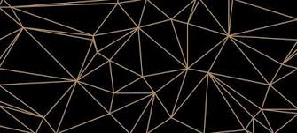
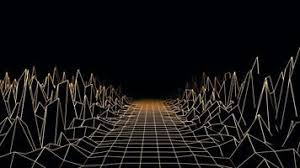
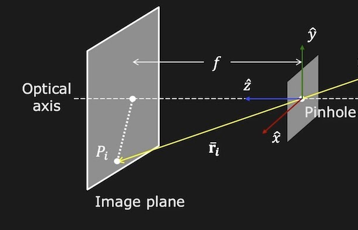

# Computer Vision Core

This repo is organized as a python package that contains utilities for various computer vision problems.

 

We mostly use opencv / numpy / scipy functionality to implement higher level utilities that are easier to use. The explicit implementation and software architecture in this repo are also a good reference for dedicated implementation (e.g. unique embedded systems).    

# Setup

----

## install with pip

----
This repo can be installed with pip as a python package.

1. clone / download this repo
2. setup your python env 3.11+ (virtual env recommended)
3. install this package into your python

    
    pip install upgrade pip
    pip install '/local/path/to/cv_core'

4. verify installation is OK:

    
    pip install show cv_core
 

## manual Setup

----

1. clone / download this repo
2. setup your python env 3.11+ (virtual env recommended)
3. install python packages according to [requirements.txt](./requirements.txt) 
4. import cv_core to your python program by adding to python path

    import sys
    sys.path.append('/local/path/to/cv_core')

# Usage

----

import cv_core and use as a python package.

This repo contains useful functionality in various computer vision areas. 

## 2D Geometry

The `cv_core.2D_geometry` module implements functionality that is related to basic 2D geometry.

major notations:
- 2D point is described by (x, y)
- 2D line is described by (a, b, c) where ax+by+c=0

Useful functionality:
- line parameters from two points
- point line parameterization
- intersect two lines
- intersect two line segments
- intersect line segment with polygon

## 3D Geometry

The `cv_core.3D_geometry` module implements functionality that is related to basic 3D geometry.

major notations:
- 3D plane is handled by `Plane3D` class
- rigid 3D transform is handled by `Rigid3dTform` class  

Useful functionality:
- 3D plane functionality:
  - project points to plane (by normal direction or any axis)
  - ray-plane intersection
  - plot
- Rigid3dTform functionality:
  - invert
  - multiply 
  - transform points

## Pinhole Camera
The `cv_core.pinhole_camera` module implements functionality that is related to camera geometry.

major notations:
- camera is handled by `PinholeCamera` class

Useful functionality:
- Camera Calibration:
  - intrinsic calibration pinhole / fisheye
  - stereo calibration
  - visual - inertial calibration (based on Kalibr)
- PinholeCamera functionality:
  - project world point to pixel
  - back-project pixel to 3D world ray
  - plot
- lens selector utility